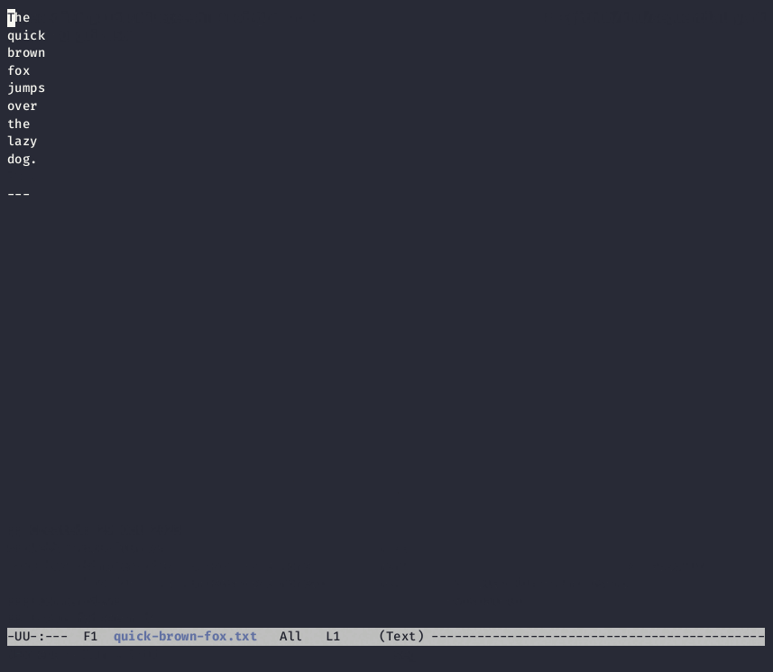

# Sequential Yank for Emacs

The sequential-yank package provides a global minor mode to copy and
paste strings sequentially.

In `sequential-yank-mode`, every killed/copied string is stored in a
global queue so they can later be yanked sequentially with the
`sequential-yank` command.



Support for multiple-cursors is built in.

## Usage

Manual installation:

```emacs-lisp
(require 'sequential-yank)

(global-set-key (kbd "M-W") #'sequential-yank-mode)
;; Default key binding
; (define-key sequential-yank-mode-map (kbd "M-Y") #'sequential-yank)
```

This package is [available via MELPA](https://melpa.org/#/sequential-yank).

```emacs-lisp
(use-package sequential-yank
  :bind
  (("M-W" . sequential-yank-mode)))
```

## See Also

- [Pastebot](https://tapbots.com/pastebot/)

    My favorite clipboard manager.  This package is heavily and shamelessly inspired by its [Sequential Paste](https://tapbots.com/pastebot/#sequence) feature.

## Author

Copyright (c) 2023 Akinori MUSHA.

Licensed under the 2-clause BSD license.  See `LICENSE.txt` for details.

Visit [GitHub Repository](https://github.com/knu/sequential-yank.el) for the latest information.
